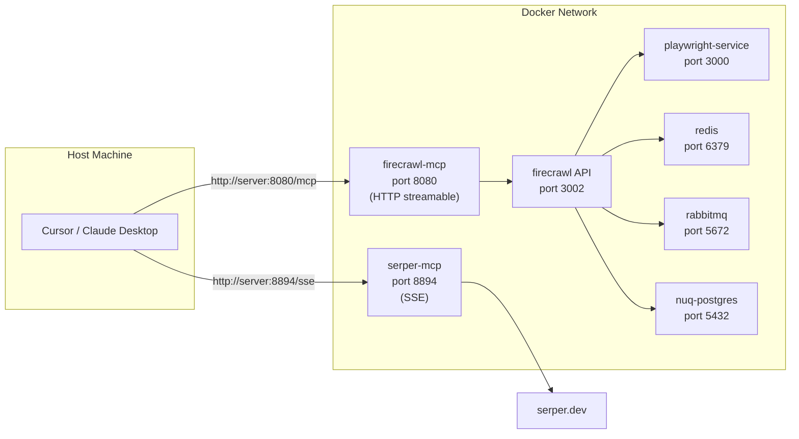

# Simple MCP Search and Fetch

Self-hosted [Firecrawl](https://github.com/firecrawl/firecrawl) with [Firecrawl MCP](https://github.com/firecrawl/firecrawl-mcp-server) and [Serper MCP](https://github.com/hightemp/go_serper_mcp_server) servers, all orchestrated via Docker Compose.

## Architecture



## Services

| Service              | Port       | Description                            |
| -------------------- | ---------- | -------------------------------------- |
| `firecrawl`          | 3002       | Firecrawl API                          |
| `playwright-service` | (internal) | Browser scraping microservice          |
| `redis`              | (internal) | Cache / rate limiting                  |
| `rabbitmq`           | (internal) | Message queue                          |
| `nuq-postgres`       | (internal) | Database                               |
| `firecrawl-mcp`      | 8080       | Firecrawl MCP server (HTTP streamable) |
| `serper-mcp`         | 8894       | Serper MCP server (SSE)                |

## Prerequisites

- Docker Compose
- At least 8 GB RAM (16 GB recommended)
- A [Serper](https://serper.dev) API key (for Google Search)

## Quick Start

1. **Create your `.env` file:**

   ```bash
   cp .env.example .env
   ```

2. **Edit `.env`** and set at minimum:
   - `SERPER_API_KEY` — your Serper API key from <https://serper.dev>
   - `BULL_AUTH_KEY` — change from `CHANGEME` to a secure value

3. **Build and start:**

   ```bash
   docker compose up --build
   ```

   First run will pull images and build the two MCP Dockerfiles. Subsequent runs are faster.

4. **Verify:**

   ```bash
   # Firecrawl API
   curl http://localhost:3002

   # Firecrawl MCP (HTTP streamable)
   curl -H "Accept: application/json, text/event-stream" http://localhost:8080/mcp

   # Serper MCP (SSE)
   curl http://localhost:8894/sse
   ```

## MCP Client Configuration

### Cursor

Add to `.cursor/mcp.json`:

```json
{
  "mcpServers": {
    "firecrawl": {
      "url": "http://<server-ip>:8080/mcp"
    },
    "serper": {
      "url": "http://<server-ip>:8894/sse"
    }
  }
}
```

### Claude Desktop

Add to `claude_desktop_config.json`:

```json
{
  "mcpServers": {
    "firecrawl": {
      "command": "curl",
      "args": [
        "-H",
        "Accept: application/json, text/event-stream",
        "http://<server-ip>:8080/mcp"
      ]
    },
    "serper": {
      "command": "curl",
      "args": ["http://<server-ip>:8894/sse"]
    }
  }
}
```

Replace `<server-ip>` with your machine's IP address (e.g., `192.168.1.x`). Use `localhost` only if the MCP client runs on the same machine.

## Configuration

All settings are controlled via `.env`. See `.env.example` for the full list of options:

| Category             | Key vars                                                                    |
| -------------------- | --------------------------------------------------------------------------- |
| **Image tags**       | `FIRECRAWL_IMAGE_TAG`, `PLAYWRIGHT_IMAGE_TAG`, `NUQ_POSTGRES_IMAGE_TAG`     |
| **Ports**            | `PORT` (host), `INTERNAL_PORT` (container)                                  |
| **Database**         | `POSTGRES_USER`, `POSTGRES_PASSWORD`, `POSTGRES_DB`                         |
| **Workers**          | `NUM_WORKERS_PER_QUEUE`, `CRAWL_CONCURRENT_REQUESTS`, `MAX_CONCURRENT_JOBS` |
| **Firecrawl MCP**    | `FIRECRAWL_API_URL`, `FIRECRAWL_API_KEY`                                    |
| **Serper MCP**       | `SERPER_API_KEY`                                                            |
| **AI (optional)**    | `OPENAI_API_KEY`, `OLLAMA_BASE_URL`, `MODEL_NAME`                           |
| **Proxy (optional)** | `PROXY_SERVER`, `PROXY_USERNAME`, `PROXY_PASSWORD`                          |

## Management

```bash
# Start in background
docker compose up -d

# View logs
docker compose logs -f

# Restart a single service
docker compose restart firecrawl-mcp

# Stop everything
docker compose down

# Stop and remove volumes (resets database/cache)
docker compose down -v
```

## Known Limitations

- **Self-hosted Firecrawl** does not include `/agent` and `/browser` endpoints; MCP tools for these will fail.
- **nuq-postgres** is amd64-only and runs under Rosetta emulation on Apple Silicon; performance may be reduced.
- No TLS/HTTPS — add a reverse proxy (e.g., Caddy, Traefik) for production use.

## Data Persistence

Docker volumes persist data across restarts:

| Volume       | Service      | Contents       |
| ------------ | ------------ | -------------- |
| `pg-data`    | nuq-postgres | Database files |
| `redis-data` | redis        | Cached data    |
